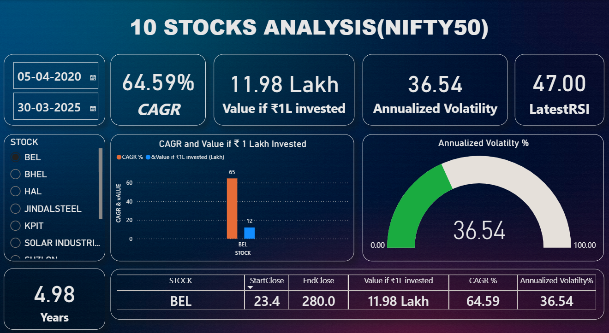
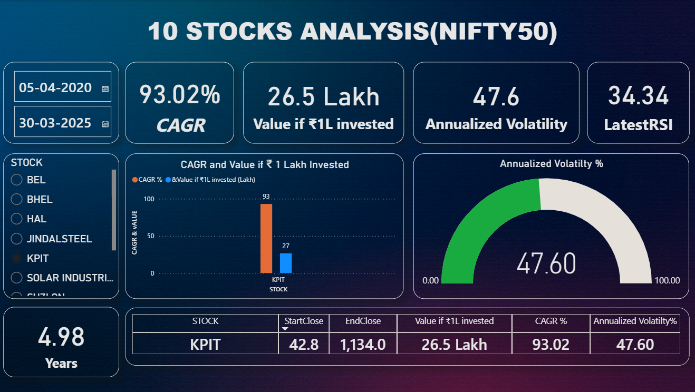

# 📊 Stock Price Analysis (NIFTY 50)


## 📝 Project Overview
This project analyzes historical stock price data of 10 selected NIFTY 50 companies, cleans and processes it using Python, and visualizes key insights using both Matplotlib and an interactive Power BI dashboard.

The goal is to demonstrate end-to-end data analytics skills — from data cleaning, feature engineering, and visualization to dashboard creation — in a real-world stock market context.

---

## 📂 Repository Structure
```
stock-price-analysis-nifty50/
│
├── data/
│   ├── 10 Stocks historical data (OHLC).xlsx # Raw historical OHLC data
│   └── 10 stocks processed data.csv         # Cleaned + feature-engineered dataset
│
├── notebook/
│   └── Stock_Price_Analysis_Nifty50.ipynb   # Jupyter Notebook with code and charts
│
├── dashboard/
│   ├── 10 Stocks Dashboard.pbix             # Power BI dashboard file
│   └── screenshots/                         # Screenshots of dashboard
│       ├── BEL.png
│       └── KPIT.png
│
└── README.md
```

---

## 🧠 Key Features
- **Data Cleaning & Preprocessing:** Removed missing values, renamed columns, and standardized formats.  
- **Feature Engineering:** Added Weekly Returns %, 4-Week Moving Average, and RSI (14-period).  
- **Visualizations:** Bar and line charts using Matplotlib to show price trends.  
- **Interactive Dashboard:** Built in Power BI with slicers and KPIs for quick insights.

---

## 🛠️ Tools & Technologies
- **Python:** `pandas`, `numpy`, `matplotlib`
- **Notebook Environment:** Jupyter Notebook
- **Business Intelligence:** Power BI

---

## 📸 Dashboard Preview
Here are two screenshots of the interactive Power BI dashboard:
**BEL**

**KPIT**


---

## 🚀 How to Use
1.  **Clone the repository:**
    ```bash
    git clone [https://github.com/OmSawant98/stock-price-analysis-nifty50.git](https://github.com/OmSawant98/stock-price-analysis-nifty50.git)
    ```
2.  **View the Code:** Open the Jupyter Notebook in `notebook/Stock_Price_Analysis_Nifty50.ipynb` to see the step-by-step analysis.
3.  **Explore the Dashboard:** Open `dashboard/10 Stocks Dashboard.pbix` in Power BI Desktop.
    - **Note:** You may need to update the data source within Power BI. Go to `Transform data` -> `Data source settings` and point it to the `data/10 stocks processed data.csv` file on your local machine.

---

## 📈 Key Insights from the Top-Performing Stock (KPIT)
- **KPIT Technologies** was the highest-performing stock in the analysis, achieving an impressive **93.02% CAGR** over ~5 years.
- An initial investment of **₹1,00,000** in KPIT grew to approximately **₹26,50,000**.
- The annualized volatility for KPIT was calculated at **47.6%**, indicating high risk alongside its high returns.

---

## 👤 Author
**Omkar Sawant** 🔗 [LinkedIn](https://www.linkedin.com/in/omkar-sawant-9118742ab/) | [GitHub](https://github.com/OmSawant98)

